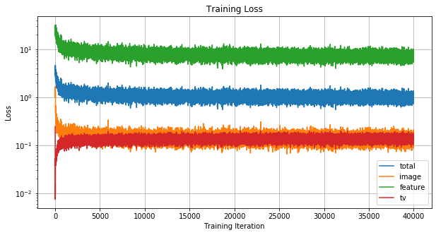
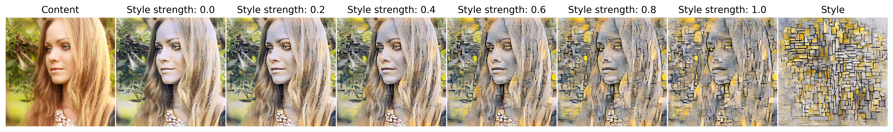
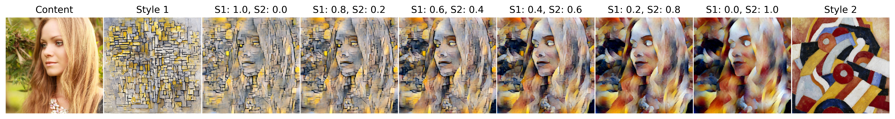
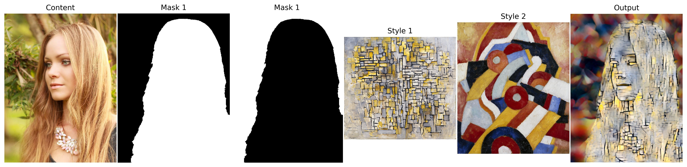
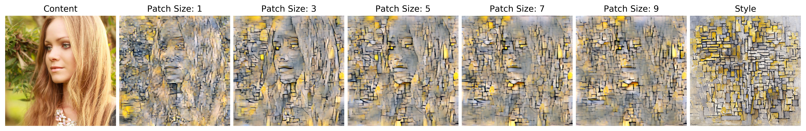

Avatar-Net: Multi-scale Zero-shot Style Transfer by Feature Decoration
---

**Unofficial Pytorch Implementation of Avatar-Net**

**Reference**: [Avatar-Net: Multi-scale Zero-shot Style Transfer by Feature Decoration, CVPR2018](https://arxiv.org/abs/1805.03857)


Requirements
--
* torch (version: 1.2.0)
* torchvision (version: 0.4.0)
* Pillow (version: 6.1.0)
* matplotlib (version: 3.1.1)

Download
--
* The trained models can be downloaded throuth the [releases](https://github.com/tyui592/Avatar-Net_Pytorch/releases/download/v0.2/check_point.pth).
* [MSCOCO train2014](http://cocodataset.org/#download) is needed to train the network.

Usage
--

### Arguments
* `--gpu-no`: GPU device number (-1: cpu, 0~N: GPU)
* `--train`: Flag for the network training (default: False)
* `--content-dir`: Path of the Content image dataset for training
* `--imsize`: Size for resizing input images (resize shorter side of the image)
* `--cropsize`: Size for crop input images (crop the image into squares)
* `--cencrop`: Flag for crop the center reigion of the image (default: randomly crop)
* `--check-point`: Check point path for loading trained network
* `--content`: Content image path to evalute the network
* `--style`: Style image path to evalute the network
* `--mask`: Mask image path for masked stylization
* `--style-strength`: Content vs Style interpolation weight (1.0: style, 0.0: content, default: 1.0)
* `--interpolatoin-weights`: Weights for multiple style interpolation
* `--patch-size`: Patch size of style decorator (default: 3)
* `--patch-stride`: Patch stride of style decorator (default: 1)


### Train example script

```
python main.py --train --gpu-no 0 --imsize 512 --cropsize 256 --content-dir ./coco2014/ --save-path ./trained_models/
```




### Test example script and image
* These figures are generated in [jupyter notebook](Avatar-Net.ipynb). You can make the figure yourself.

#### Generate the stylized image with a single style (Content-style interapoltion)

```
python main.py --check-point ./trained_models/check_point.pth --imsize 512 --cropsize 512 --cencrop --content ./sample_images/content/blonde_girl.jpg --style ./sample_images/style/mondrian.jpg --style-strength 1.0
```



#### Generate the stylized image with multiple style

```
python main.py --check-point ./trained_models/check_point.pth --imsize 512 --cropsize 512 --content ./sample_images/content/blonde_girl.jpg --style ./sample_images/style/mondrian.jpg ./sample_images/style/abstraction.jpg --interpolation-weights 0.5 0.5
```




#### Generate the stylized image with multiple style and mask

```
python main.py --check-point ./trained_models/check_point.pth --imsize 512 --cropsize 512 --content ./sample_images/content/blonde_girl.jpg --style ./sample_images/style/mondrian.jpg ./sample_images/style/abstraction.jpg --mask ./sample_images/mask/blonde_girl_mask1.jpg ./sample_images/mask/blonde_girl_mask2.jpg --interpolation-weights 1.0 1.0
```




#### Generate the stylized image with varying patch size

```
python main.py --check-point ./trained_models/check_point.pth --imsize 512 --cropsize 512 --content ./sample_images/content/blonde_girl.jpg --style ./sample_images/style/mondrian.jpg --patch-size 3
```




#### Generate the stylized image with varying patch stride

```
python main.py --check-point ./trained_models/check_point.pth --imsize 512 --cropsize 512 --content ./sample_images/content/blonde_girl.jpg --style ./sample_images/style/mondrian.jpg --patch-stride 4
```


